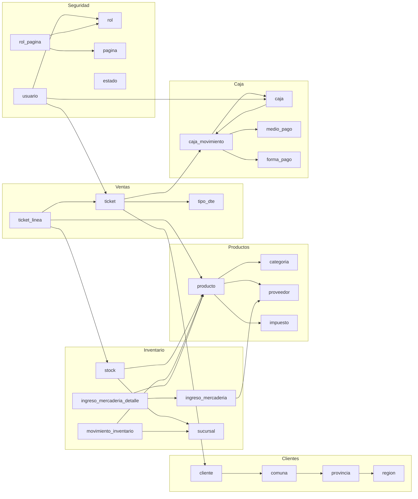

# Arquitectura funcional del sistema

Este diagrama muestra la organización del sistema por **módulos funcionales** y las relaciones entre sus tablas.

```mermaid
flowchart LR

%% =========================
%% MODULO CLIENTES
%% =========================

subgraph Clientes
CLIENTE[cliente]
COMUNA[comuna]
PROVINCIA[provincia]
REGION[region]

CLIENTE --> COMUNA
COMUNA --> PROVINCIA
PROVINCIA --> REGION
end


%% =========================
%% MODULO PRODUCTOS
%% =========================

subgraph Productos
PRODUCTO[producto]
CATEGORIA[categoria]
PROVEEDOR[proveedor]
IMPUESTO[impuesto]

PRODUCTO --> CATEGORIA
PRODUCTO --> PROVEEDOR
PRODUCTO --> IMPUESTO
end


%% =========================
%% MODULO INVENTARIO
%% =========================

subgraph Inventario
STOCK[stock]
MOVIMIENTO_INVENTARIO[movimiento_inventario]
INGRESO_MERCADERIA[ingreso_mercaderia]
INGRESO_MERCADERIA_DETALLE[ingreso_mercaderia_detalle]
SUCURSAL[sucursal]

STOCK --> PRODUCTO
STOCK --> SUCURSAL

MOVIMIENTO_INVENTARIO --> PRODUCTO
MOVIMIENTO_INVENTARIO --> SUCURSAL

INGRESO_MERCADERIA --> PROVEEDOR
INGRESO_MERCADERIA_DETALLE --> INGRESO_MERCADERIA
INGRESO_MERCADERIA_DETALLE --> PRODUCTO
end


%% =========================
%% MODULO VENTAS
%% =========================

subgraph Ventas
TICKET[ticket]
TICKET_LINEA[ticket_linea]
TIPO_DTE[tipo_dte]

TICKET --> CLIENTE
TICKET --> TIPO_DTE
TICKET_LINEA --> TICKET
TICKET_LINEA --> PRODUCTO
end


%% =========================
%% MODULO CAJA
%% =========================

subgraph Caja
CAJA[caja]
CAJA_MOVIMIENTO[caja_movimiento]
MEDIO_PAGO[medio_pago]
FORMA_PAGO[forma_pago]

CAJA_MOVIMIENTO --> CAJA
CAJA_MOVIMIENTO --> MEDIO_PAGO
CAJA_MOVIMIENTO --> FORMA_PAGO
end


%% =========================
%% MODULO SEGURIDAD
%% =========================

subgraph Seguridad
USUARIO[usuario]
ROL[rol]
PAGINA[pagina]
ROL_PAGINA[rol_pagina]
ESTADO[estado]

USUARIO --> ROL
ROL_PAGINA --> ROL
ROL_PAGINA --> PAGINA
end


%% =========================
%% RELACIONES ENTRE MODULOS
%% =========================

USUARIO --> TICKET
USUARIO --> CAJA

CAJA --> CAJA_MOVIMIENTO

TICKET --> CAJA_MOVIMIENTO
TICKET_LINEA --> STOCK
```