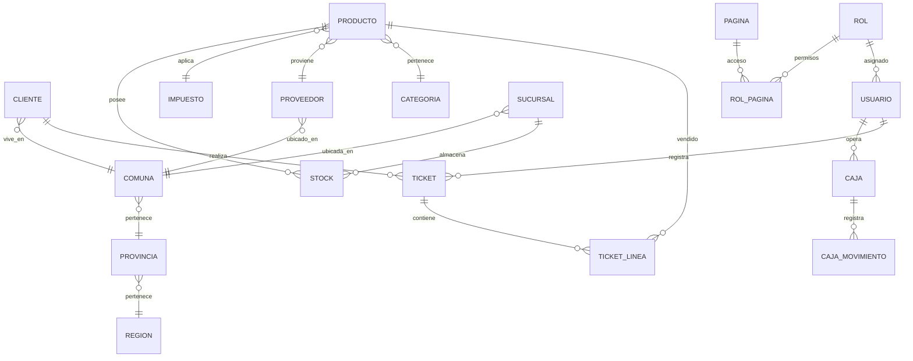

# Modelo Relacional Completo

Este diagrama muestra todas las tablas de la base de datos y sus relaciones.

```mermaid
erDiagram

CLIENTE ||--o{ TICKET : realiza
USUARIO ||--o{ TICKET : registra
TICKET ||--o{ TICKET_LINEA : contiene

PRODUCTO ||--o{ TICKET_LINEA : vendido
PRODUCTO }o--|| CATEGORIA : pertenece
PRODUCTO }o--|| PROVEEDOR : proviene
PRODUCTO }o--|| IMPUESTO : aplica

PRODUCTO ||--o{ STOCK : posee
SUCURSAL ||--o{ STOCK : almacena

CLIENTE }o--|| COMUNA : vive_en
PROVEEDOR }o--|| COMUNA : ubicado_en
SUCURSAL }o--|| COMUNA : ubicada_en

COMUNA }o--|| PROVINCIA : pertenece
PROVINCIA }o--|| REGION : pertenece

CAJA ||--o{ CAJA_MOVIMIENTO : registra
USUARIO ||--o{ CAJA : opera

ROL ||--o{ USUARIO : asignado
ROL ||--o{ ROL_PAGINA : permisos
PAGINA ||--o{ ROL_PAGINA : acceso
```