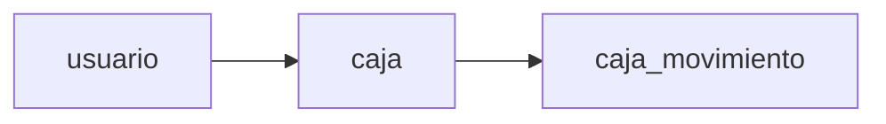

# Módulo Caja

Gestiona la apertura, cierre y movimientos de caja.

---

## Diagrama del módulo

---

## Tabla: caja

| Campo | Tipo | Null | PK |
|------|------|------|----|
| id | int | NO | PK |
| apertura_usuario | char(20) | NO | |
| apertura_fechahora | datetime | NO | |
| apertura_monto | int | NO | |
| cierre_usuario | char(20) | YES | |
| cierre_fechahora | datetime | YES | |
| cierre_monto | int | YES | |
| id_sucursal | int | NO | |

---

## Tabla: caja_movimiento

| Campo | Tipo | Null | PK | FK |
|------|------|------|----|----|
| id | int | NO | PK | |
| monto | int | NO | | |
| observacion | varchar(150) | YES | | |
| fecha_hora | datetime | NO | | |
| id_usuario | int | NO | | usuario.id |
| id_caja | int | NO | | caja.id |
| id_medio_pago | int | NO | | medio_pago.id |