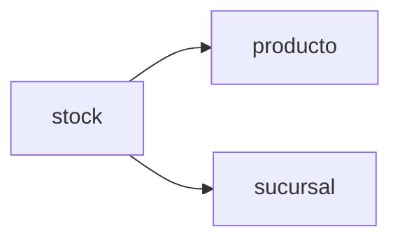

# Módulo Inventario

Gestiona el stock de productos por sucursal.

---

## Diagrama del módulo

---

## Tabla: sucursal

| Campo | Tipo | Null | PK | FK |
|------|------|------|----|----|
| id | int | NO | PK | |
| nombre | varchar(150) | NO | | |
| direccion | varchar(200) | YES | | |
| telefono | varchar(20) | YES | | |
| id_comuna | int | YES | | comuna.id |

---

## Tabla: stock

| Campo | Tipo | Null | PK | FK |
|------|------|------|----|----|
| id | int | NO | PK | |
| id_producto | int | NO | | producto.id |
| id_sucursal | int | NO | | sucursal.id |
| cantidad | int | NO | | |