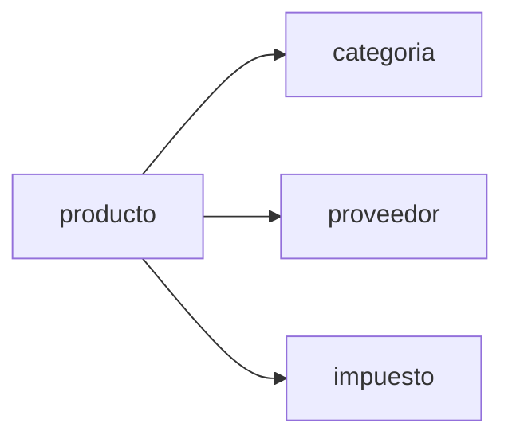

# Módulo Productos

Este módulo contiene el catálogo de productos y sus clasificaciones.

---

## Diagrama del módulo

---

## Tabla: producto

| Campo | Tipo | Null | PK | FK | Identity |
|------|------|------|----|----|---------|
| id | int | NO | PK | | YES |
| nombre | varchar(200) | NO | | | |
| precio | int | NO | | | |
| id_categoria | int | NO | | categoria.id | |
| id_proveedor | int | YES | | proveedor.id | |
| id_impuesto | int | NO | | impuesto.id | |
| id_estado | int | NO | | estado.id | |

---

## Tabla: categoria

| Campo | Tipo | Null | PK | FK |
|------|------|------|----|----|
| id | int | NO | PK | |
| nombre | varchar(100) | NO | | |
| id_categoria_padre | int | YES | | categoria.id |
| id_estado | int | NO | | estado.id |

---

## Tabla: proveedor

| Campo | Tipo | Null | PK | FK |
|------|------|------|----|----|
| id | int | NO | PK | |
| rut | char(20) | NO | | |
| razon_social | varchar(200) | NO | | |
| direccion | varchar(200) | YES | | |
| telefono | char(20) | YES | | |
| email | varchar(100) | YES | | |
| id_comuna | int | YES | | comuna.id |

---

## Tabla: impuesto

| Campo | Tipo | Null | PK |
|------|------|------|----|
| id | int | NO | PK |
| nombre | varchar(100) | NO | |
| valor | decimal | NO | |