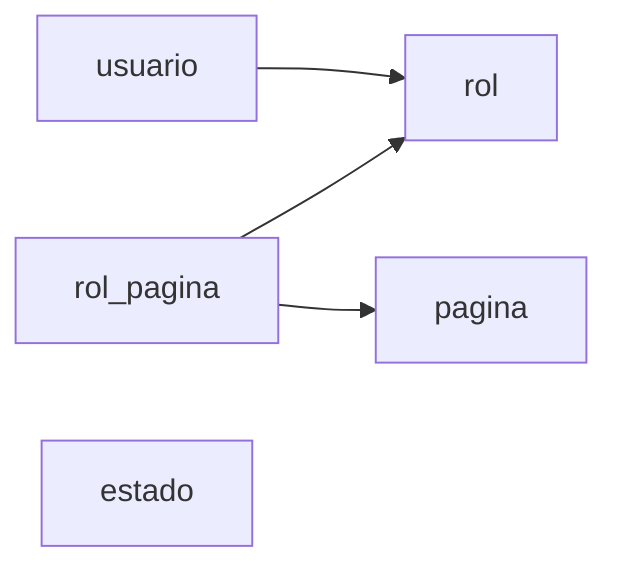

# Módulo Seguridad

Gestiona usuarios, roles y permisos del sistema.

---

## Diagrama del módulo

---

## Tabla: usuario

| Campo | Tipo | Null | PK | FK |
|------|------|------|----|----|
| id | int | NO | PK | |
| username | varchar(50) | NO | | |
| nombre | varchar(100) | NO | | |
| apellido | varchar(100) | NO | | |
| email | varchar(100) | YES | | |
| password | varchar(200) | NO | | |
| id_estado | int | NO | | estado.id |

---

## Tabla: rol

| Campo | Tipo | Null | PK |
|------|------|------|----|
| id | int | NO | PK |
| nombre | varchar(100) | NO | |

---

## Tabla: pagina

| Campo | Tipo | Null | PK |
|------|------|------|----|
| id | int | NO | PK |
| nombre | varchar(100) | NO | |

---

## Tabla: rol_pagina

| Campo | Tipo | Null | PK | FK |
|------|------|------|----|----|
| id | int | NO | PK | |
| id_rol | int | NO | | rol.id |
| id_pagina | int | NO | | pagina.id |

---

## Tabla: estado

| Campo | Tipo | Null | PK |
|------|------|------|----|
| id | int | NO | PK |
| nombre | char(20) | NO | |