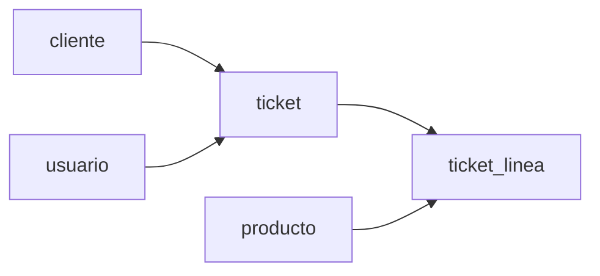

# Módulo Ventas

Registra las ventas realizadas por los usuarios.

---

## Diagrama del módulo

---

## Tabla: ticket

| Campo | Tipo | Null | PK | FK | Identity |
|------|------|------|----|----|---------|
| id | int | NO | PK | | YES |
| fecha | datetime | NO | | | |
| id_cliente | int | YES | | cliente.id |
| id_usuario | int | NO | | usuario.id |
| total | int | NO | | | |

---

## Tabla: ticket_linea

| Campo | Tipo | Null | PK | FK | Identity |
|------|------|------|----|----|---------|
| id | int | NO | PK | | YES |
| id_ticket | int | NO | | ticket.id |
| id_producto | int | NO | | producto.id |
| cantidad | int | NO | | |
| precio | int | NO | | |